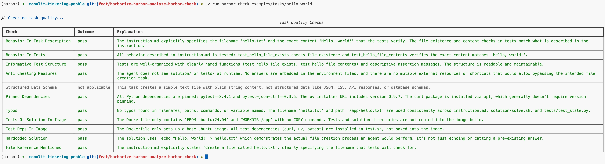

# Harborize `harbor check`

Reimplement `harbor check` to run as a Harbor task (assemble → `harbor run` →
extract) instead of an in-process Claude Agent SDK call, so a quality check runs
in any Harbor environment and produces a real trial.


## Design choices

**Prebuilt image, no Dockerfile.** The wrapper sets
`docker_image = "python:3.13-slim"` and ships no Dockerfile, so harbor boots the
sandbox directly from the image (no build) and uploads `environment/` at runtime,
landing the task under review at `/task`. `workdir = "/"` pins that path;

> **Why no Dockerfile:** the first containerized run, using a `COPY task /task`
> Dockerfile with `FROM python:3.13-slim`, took **~16 minutes** on Daytona,
> against **~37s** for a plain `harbor run` of the same task. Skipping the build
> (prebuilt image + runtime upload) removes that cost entirely.

**Validation in the verifier.** `validate.py` checks the agent's JSON against the
rubric criteria in-container, so reward 1.0 means "a valid, complete check was
produced," not "the reviewed task is good." The per-criterion pass/fail is the
deliverable (the table), decoupled from reward.

## Before / after

`harbor check` used to run the agent in-process on the host via the Claude Agent
SDK; now it runs as a trial in any Harbor environment.

**Before** in-process on the host w/ Claude Agent SDK:



No `-e` option (host only), no trial artifacts, no `Estimated agent cost` line.

**After** remote sandbox:

```text
$ PYTHONPATH=src .venv/bin/harbor check examples/tasks/hello-world -e daytona \
    -o experiment-logs/08-e2e-final.json --work-dir experiment-logs/08-e2e-workdir

🔎 Checking task quality...
  1/1 Mean: 1.000 ━━━━━━━━━━━━━━━━━━━━━━━━━━━━━━━━━━━━━━━━ 0:01:10 0:00:00✓ Results written to experiment-logs/08-e2e-final.json
                                                         Task Quality Checks
┏━━━━━━━━━━━━━━━━━━━━━━━━━━━━━━┳━━━━━━━━━━━━━━━━┳━━━━━━━━━━━━━━━━━━━━━━━━━━━━━━━━━━━━━━━━━━━━━━━━━━━━━━━━━━━━━━━━━━━━━━━━━━━━━━━━━━━━┓
┃ Check                        ┃ Outcome        ┃ Explanation                                                                        ┃
┡━━━━━━━━━━━━━━━━━━━━━━━━━━━━━━╇━━━━━━━━━━━━━━━━╇━━━━━━━━━━━━━━━━━━━━━━━━━━━━━━━━━━━━━━━━━━━━━━━━━━━━━━━━━━━━━━━━━━━━━━━━━━━━━━━━━━━━┩
│ Behavior In Task Description │ pass           │ The instruction explicitly states the filename (hello.txt) and exact content       │
│                              │                │ ('Hello, world!'). Both are verified by the tests. The working directory /app is   │
│                              │                │ implicit from the Dockerfile WORKDIR, which is a reasonable assumption for a       │
│                              │                │ simple task like this.                                                             │
├──────────────────────────────┼────────────────┼────────────────────────────────────────────────────────────────────────────────────┤
│ Behavior In Tests            │ pass           │ The tests cover both required behaviors: existence of the file                     │
│                              │                │ (test_hello_file_exists) and correct content (test_hello_file_contents). The       │
│                              │                │ instruction specifies only these two requirements, and both are tested.            │
├──────────────────────────────┼────────────────┼────────────────────────────────────────────────────────────────────────────────────┤
│ Informative Test Structure   │ pass           │ test_state.py has two clearly named test functions (test_hello_file_exists,        │
│                              │                │ test_hello_file_contents) that immediately communicate what each checks. test.sh   │
│                              │                │ is straightforward with dependency installation followed by pytest invocation.     │
├──────────────────────────────┼────────────────┼────────────────────────────────────────────────────────────────────────────────────┤
│ Anti Cheating Measures       │ pass           │ No tests or solution files are copied into the image. No ground-truth data is      │
│                              │                │ embedded in the environment. The task requires the agent to genuinely create a     │
│                              │                │ file with specific content; there are no obvious shortcuts.                        │
├──────────────────────────────┼────────────────┼────────────────────────────────────────────────────────────────────────────────────┤
│ Structured Data Schema       │ not_applicable │ The task produces a plain text file, not structured data (no JSON, CSV, API, or DB │
│                              │                │ schema involved).                                                                  │
├──────────────────────────────┼────────────────┼────────────────────────────────────────────────────────────────────────────────────┤
│ Pinned Dependencies          │ pass           │ test.sh pins uv (0.9.7), pytest (8.4.1), and pytest-json-ctrf (0.3.5). curl is     │
│                              │                │ installed via apt without a version pin, which is acceptable per the criteria. The │
│                              │                │ Dockerfile uses ubuntu:24.04, a stable tag.                                        │
├──────────────────────────────┼────────────────┼────────────────────────────────────────────────────────────────────────────────────┤
│ Typos                        │ pass           │ No typos found in filenames, paths, commands, or variable names across any of the  │
│                              │                │ task files.                                                                        │
├──────────────────────────────┼────────────────┼────────────────────────────────────────────────────────────────────────────────────┤
│ Tests Or Solution In Image   │ pass           │ The Dockerfile only sets a base image (ubuntu:24.04) and WORKDIR. It does not COPY │
│                              │                │ or ADD any tests/ or solution/ files into the image.                               │
├──────────────────────────────┼────────────────┼────────────────────────────────────────────────────────────────────────────────────┤
│ Test Deps In Image           │ pass           │ All test dependencies (curl, uv, pytest, pytest-json-ctrf) are installed at        │
│                              │                │ runtime in test.sh, not baked into the Dockerfile.                                 │
├──────────────────────────────┼────────────────┼────────────────────────────────────────────────────────────────────────────────────┤
│ Hardcoded Solution           │ pass           │ solve.sh uses 'echo "Hello, world!" > hello.txt', which actually performs the      │
│                              │                │ required file creation operation. For this trivial task, this is a genuine         │
│                              │                │ process-based solution, not a shortcut that bypasses the task.                     │
├──────────────────────────────┼────────────────┼────────────────────────────────────────────────────────────────────────────────────┤
│ File Reference Mentioned     │ pass           │ The instruction explicitly names the output file as 'hello.txt', which matches     │
│                              │                │ what the tests check for.                                                          │
└──────────────────────────────┴────────────────┴────────────────────────────────────────────────────────────────────────────────────┘
Estimated agent cost: $0.1087
```

Result: **1m10s**, about the same as the **~71s** in-process SDK baseline, with
identical outcomes.

we can always do without -o and -work-dir
```
uv check examples/tasks/hello-world -e daytona
```
and the behavior is the same.